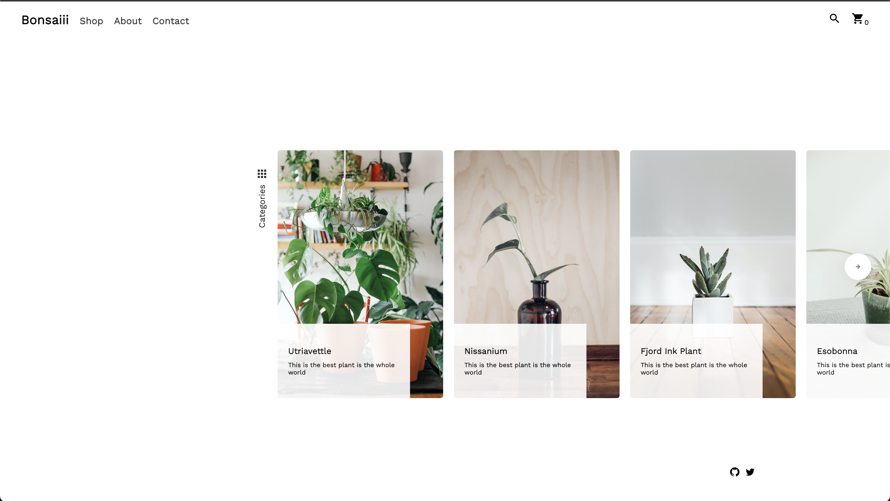
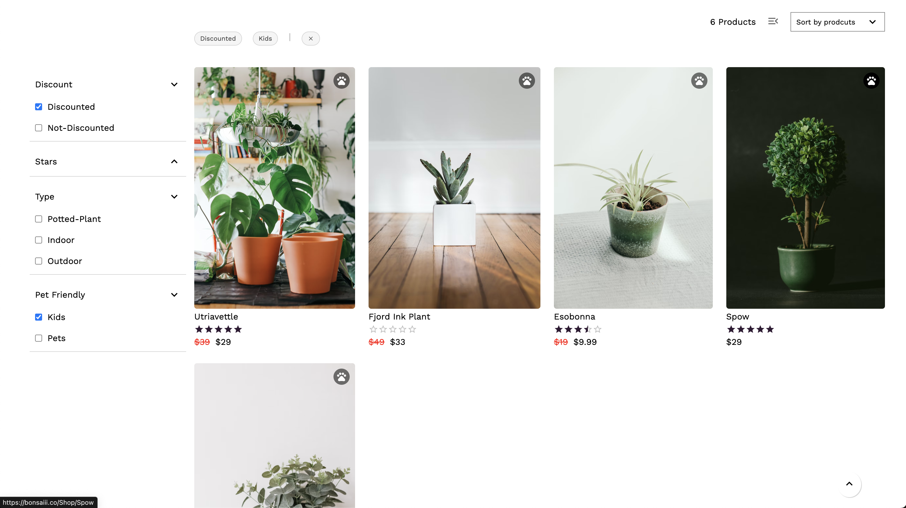
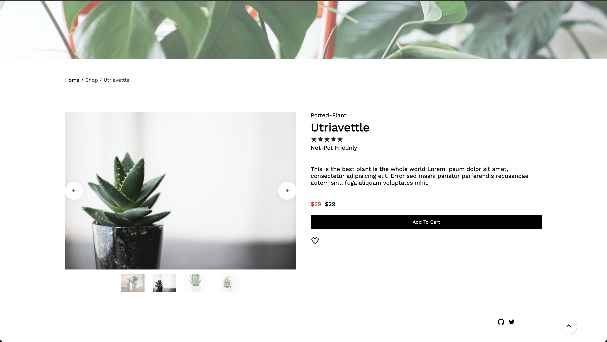
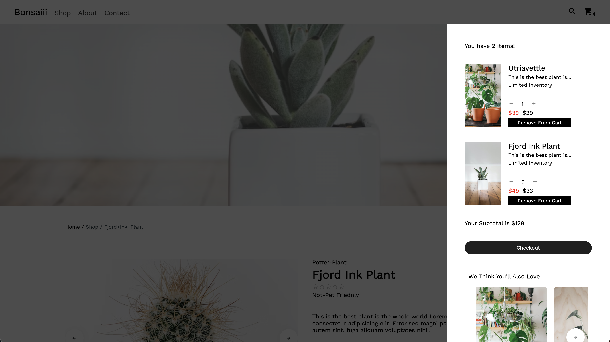
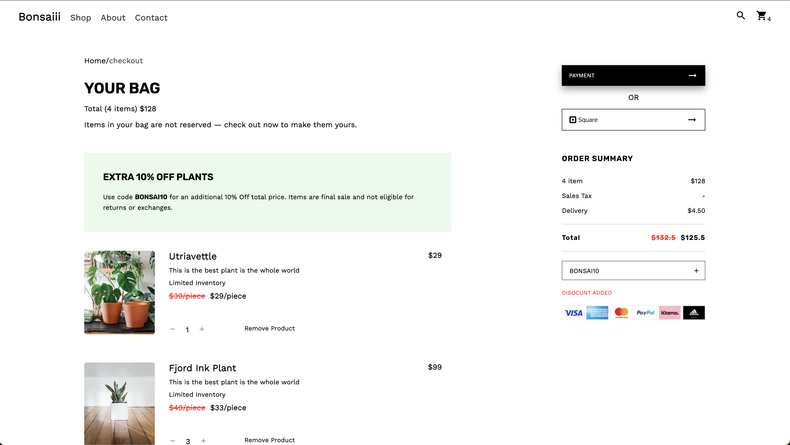
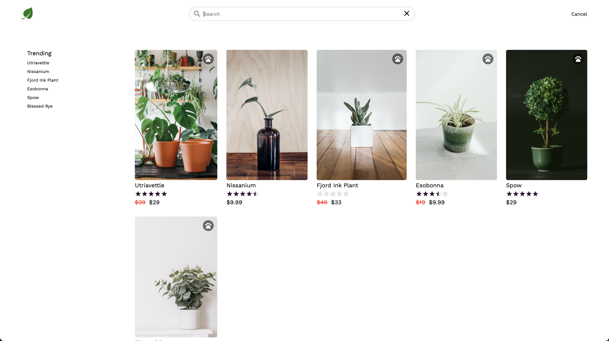
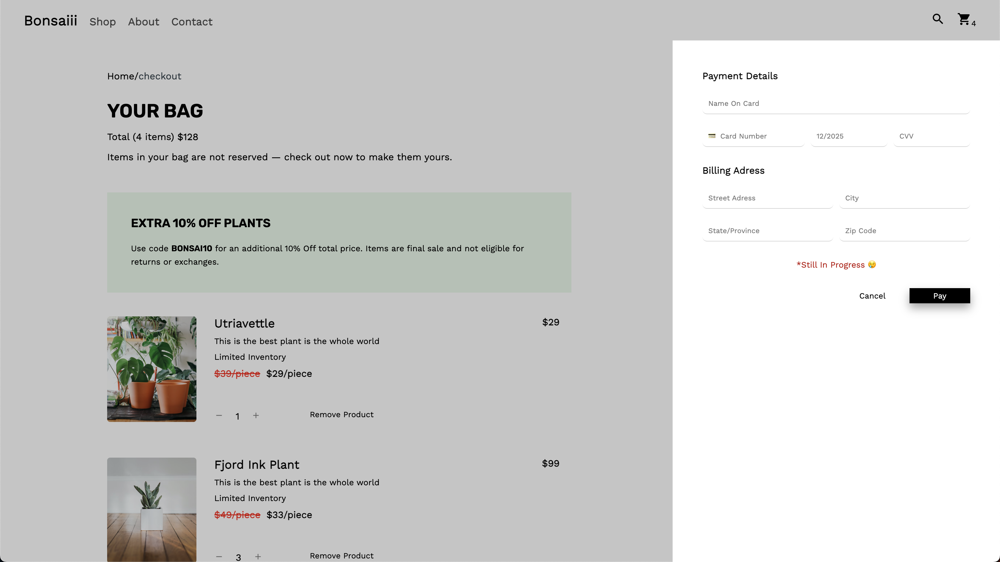

# Bonsaiii

Bonsaiii is an E-commerce web app to let users shop for plants. Users can search for products, filter products, add/remove products, and checkout.

# Live Link <a href="https://bonsaiii.co/" target="_blank">Bonsaiiii.co</a>

## Features:

- View Products
- Filter Products
- Add To Cart
- Modify Cart
- Remove Product From Cart
- Search Products
- Make Payment 🔨🔨

## Tech Used:

- React JS
- Vite JS
- Firebase
- Google Analytics
- Zustand For State Management
- Custom Hooks

